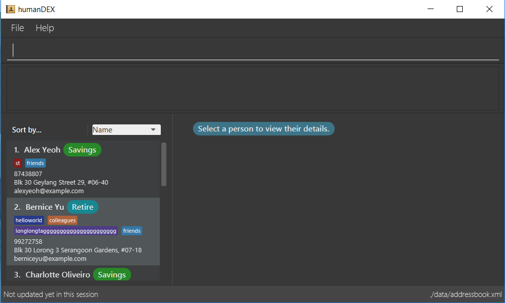

= humanDex
ifdef::env-github,env-browser[:relfileprefix: docs/]
ifdef::env-github,env-browser[:outfilesuffix: .adoc]

https://travis-ci.org/CS2103AUG2017-F11-B1/main[image:https://travis-ci.org/CS2103AUG2017-F11-B1/main.svg?branch=master[Build Status]]

ifdef::env-github[]

endif::[]

ifndef::env-github[]
image::images/Ui.png[width="600"]
endif::[]

Too many clients on hand? Not enough time to save their details?

Welcome to *humanDEX*! This is an address book specially made for insurance agents who need an efficient application for managing their long list of clients and colleagues!

humanDEX helps you to manage your contact in a more flexible way!
In the current version (v1.5). It allows you to create your own field - add any information you need to remember to your contacts. Have a new, exciting client? Add their contacts just with his/her name and group! Have too many clients at hand? You can sort your big list of clients according to their details, as well as find a specific client. You can also see all the insurances you're selling with a quick command!

"Time is money" - well, for insurance agents, "Information is money"! With the most recent update, humanDEX now has extra security measures to safeguard your precious sales information. Simply create a new password and prevent others from stealing your clients' details!

In future version of humanDEX, we aim to make contacts exchange much easier by exporting contact list and clients/colleagues will be able to save your number when you save theirs! Look out for more exciting features in the upcoming updates.

humanDEX - the best solution to keeping your busy insurance agent life organised.

== Site Map

* <<UserGuide#, User Guide>>
* <<DeveloperGuide#, Developer Guide>>
* <<AboutUs#, About Us>>
* <<ContactUs#, Contact Us>>

== Acknowledgements

* Some parts of this sample application were inspired by the excellent http://code.makery.ch/library/javafx-8-tutorial/[Java FX tutorial] by
_Marco Jakob_.
* Built on the existing https://github.com/se-edu/addressbook-level4[AddressBook-Level4] project created by SE-EDU initiative.

== Licence : link:LICENSE[MIT]
